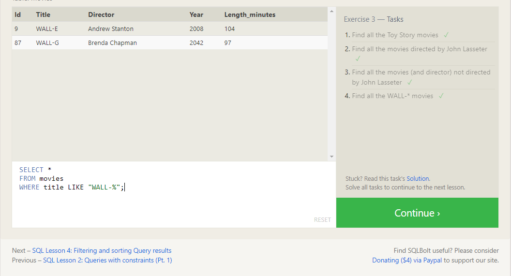
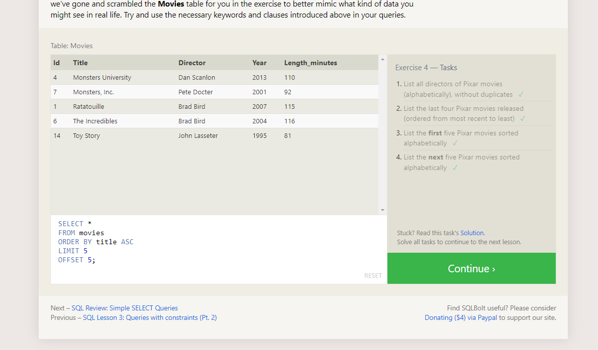
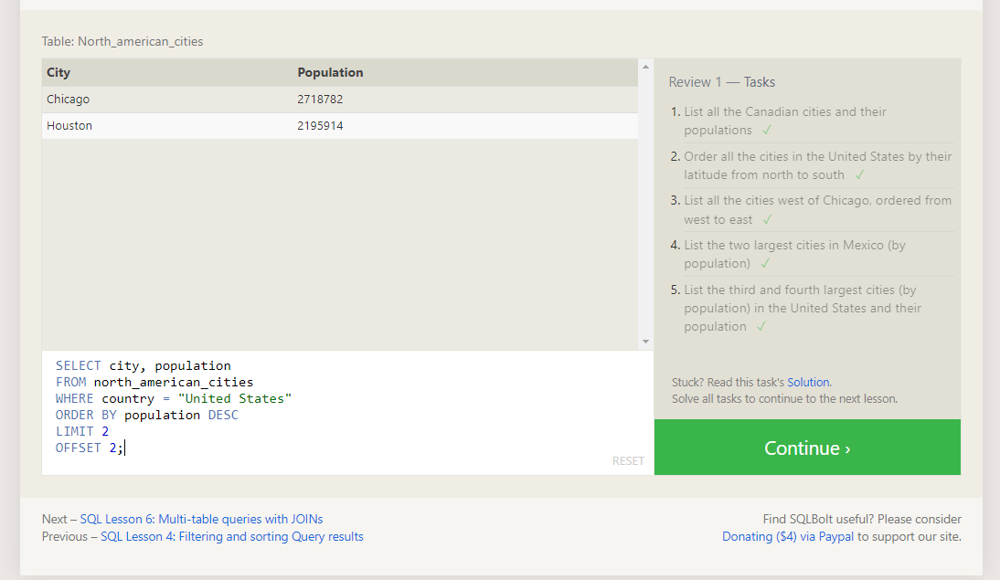
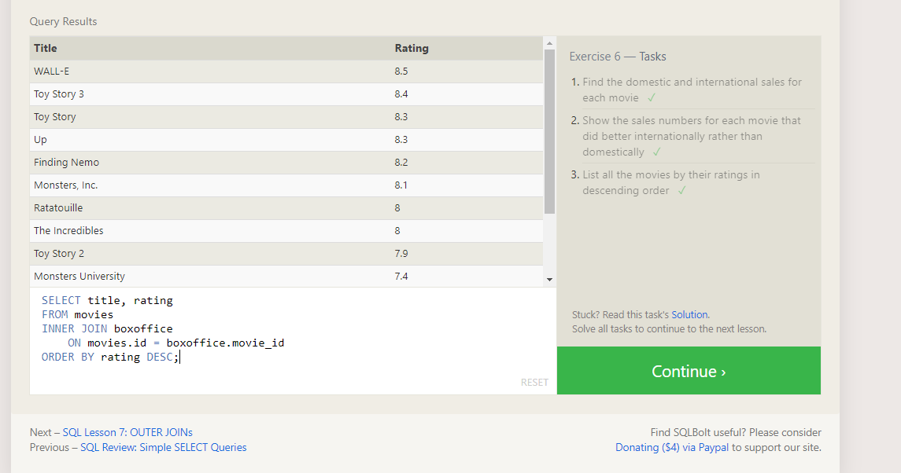
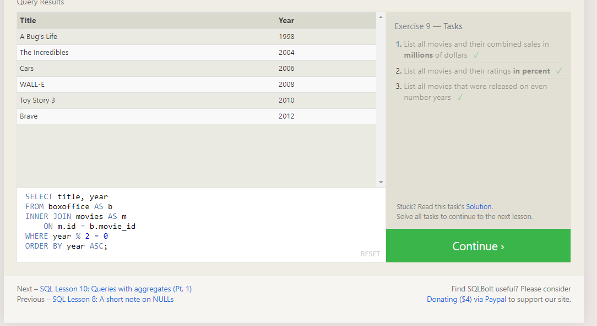
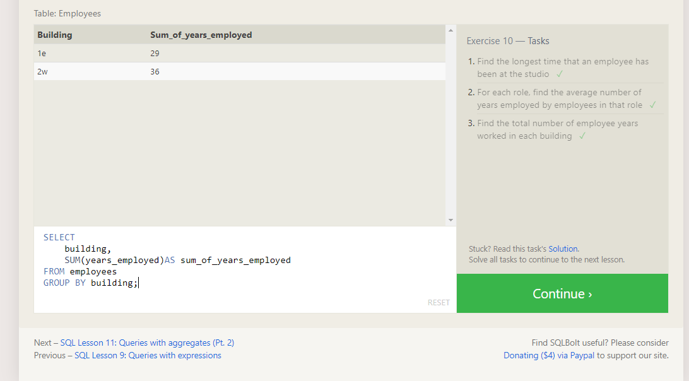
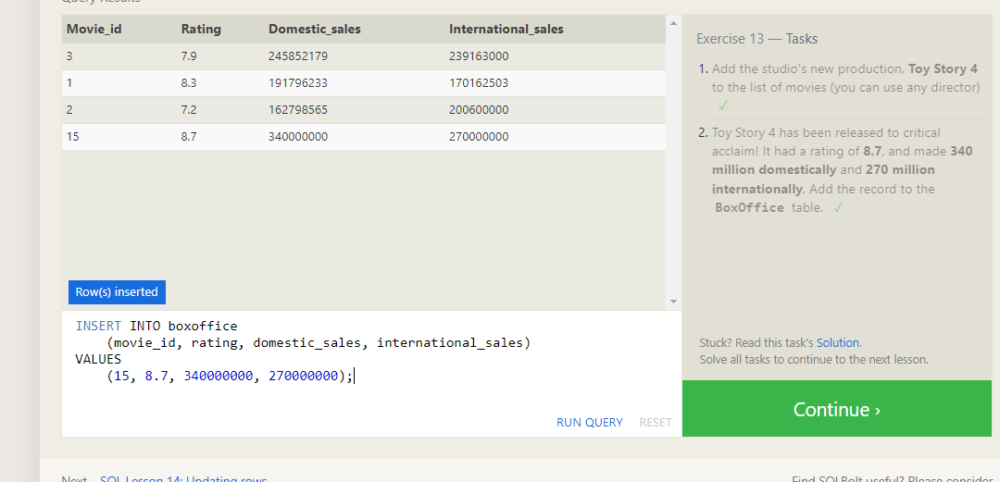
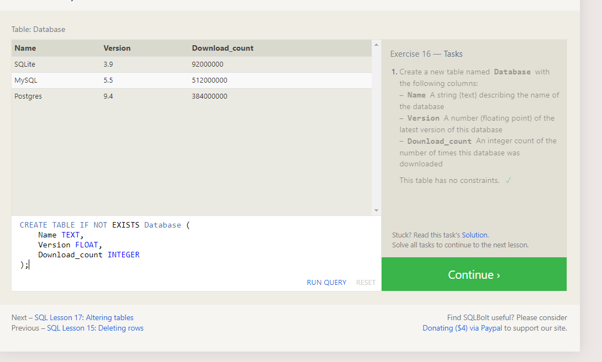
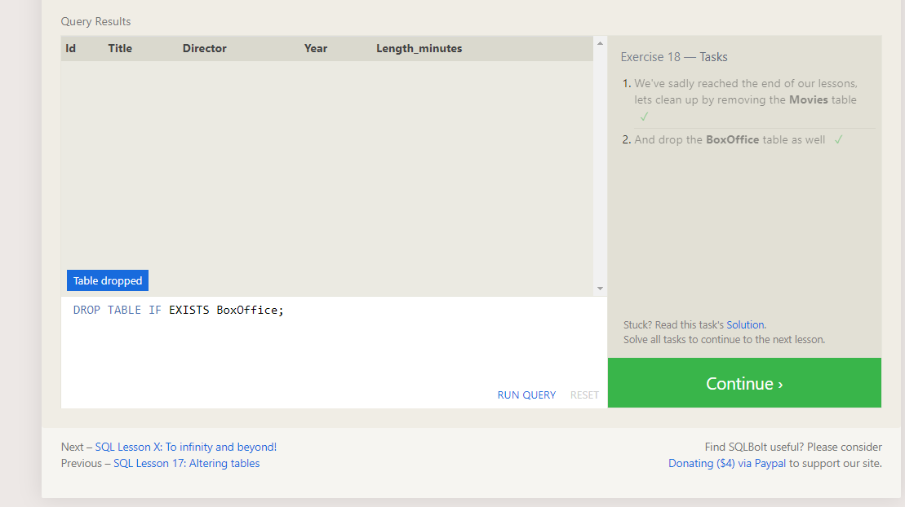

### summary of sql practice  :

- `select` , `insert` , `update` , `delete`

    - `select` : to select which column you want to render.

    - `insert` : to insert data in specifc columns.

    - `update` : modify data by column names and the value i want to edit.

    - `delete` : delete table or  delete rows form tables.

- `where` : condition for the query to render depend on the where condetion.

    - `=`,`!=`,`>`,`<`,`>=`,`<=`,`AND`,`OR`,`BETWEEN`,`LIKE`,`IS NULL`, `IS NOT NULL` some of condtions that the where take to compare arguments.

- `order` : to order the values we can group it by `asc` or `desc`. and can take limit valye to render by `limit` and `offset` to take the specifc number of value i want to render depend on the order.

- `inner/left/right/full join` : can give me a shared data between tables however you want the whole data shared between tabels or part of it.

`AS` : which give a inital name for the column or table to let you use a shortcut.

 #### Math functions :

  - `SUM` : return the summation of number in the column.

  - `MAX` : return the max number in the column.

  - `MIN` : return the minmium number in the column. 

  - `AVG` : return the avverage number for the column.

